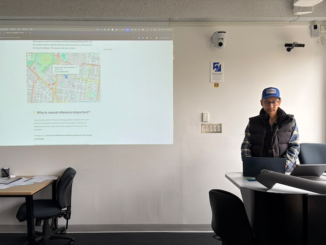
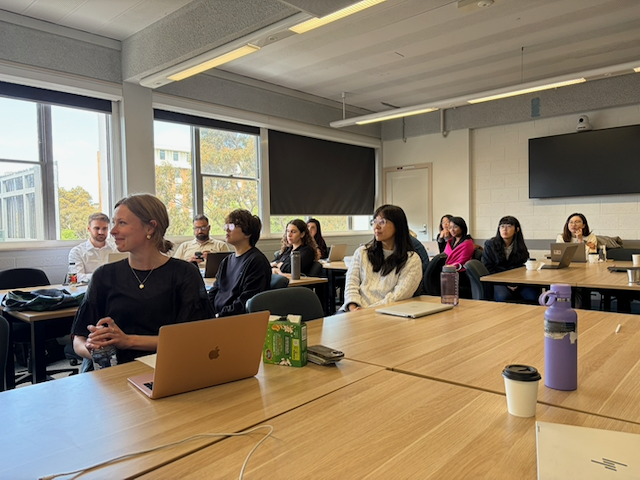
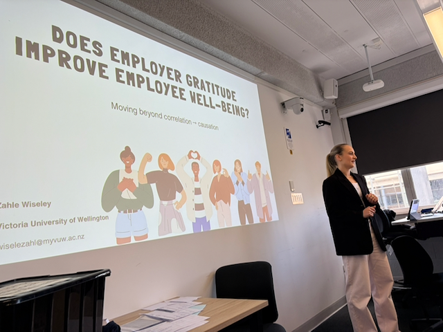
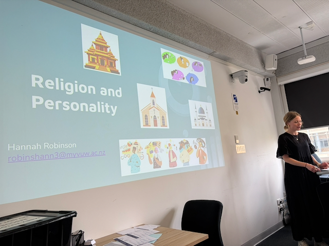
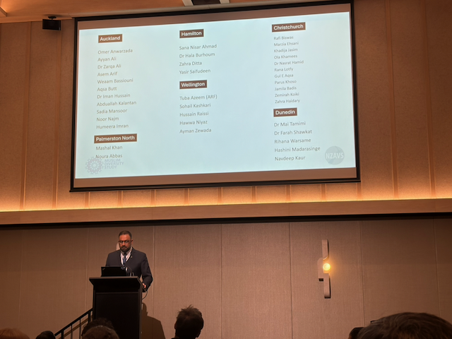
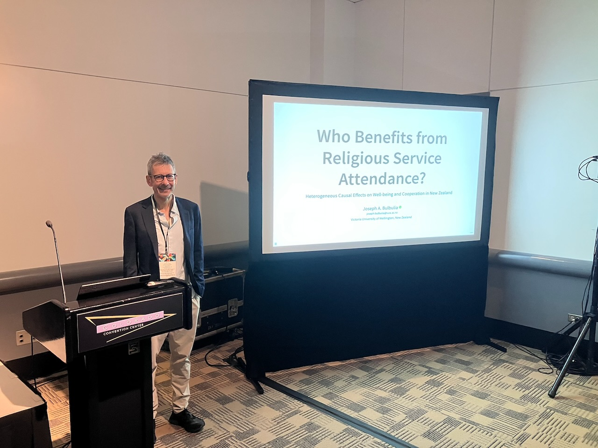

## 2026

### New Cambridge Handbook Chapter Published

**June 2026 | Cambridge University Press**

Victor Counted, Maureen Miner, and Joseph Bulbulia have published *Australia and New Zealand: The psychology of religion up to 2020* in *The Cambridge Handbook of the International Psychology of Religion*.

---

### Two OTTO Lab Articles Enter Production at *Religion, Brain & Behavior*

**June 2026 | Religion, Brain & Behavior**

Two OTTO Lab articles are now in production at *Religion, Brain & Behavior*.

- The first OTTO Lab article now in production is *Beyond deficit narratives: Religious practice, meaning, and resilience in a national sample of New Zealand Muslims*, by Joseph Bulbulia, Usman Afzali, Aarif Rasheed, Geoffrey Troughton, Kumar Yogeeswaran, and Chris Sibley. [DOI](https://doi.org/10.1080/2153599X.2026.2645568)

- The second OTTO Lab article now in production is *Religion, cooperation, and prosocial behavior: Methods and evidence for causality*, by Michael McCullough, Don Davis, and Joseph Bulbulia. [DOI](https://doi.org/10.1080/2153599X.2026.2695639)

Taken together, the articles reflect OTTO Lab's continuing work on religion, social behaviour, meaning, and resilience.

---

### Dr Inkuk Kim Takes Up Postdoctoral Fellowship at GSU

**March 2026 | Georgia State University**

It is with mixed feelings that we say goodbye to Dr Inkuk Kim, who has taken up a postdoctoral fellowship with [Professor Don E. Davis](https://news.gsu.edu/coronavirus-expert/don-davis-jr/) at the HAPPI Lab at Georgia State University.

Inkuk remains a Fellow of OTTO Lab and is working on a number of projects related to environmental psychology, trust in science, and character formation over the adult lifespan.

---

### Places Map Is Live

**20 February 2026 | Victoria University of Wellington**

The Places Map project is now live at [placesmap.org](https://www.placesmap.org/). Places Map is an open research infrastructure for mapping places of worship and supporting cross-cultural policy research.

Project code and workflows are available at [github.com/go-bayes/places-of-worship](https://github.com/go-bayes/places-of-worship).

---

### Two New PhD Students Join OTTO Lab

**January 2026 | Victoria University of Wellington**

We are delighted to welcome two new PhD students to OTTO Lab: Mekonnen Tsehay and Mohammad Islam.

Mekonnen joins the lab from Ethiopia. He is estimating the causal effects of religious ritual behaviours on health and wellbeing among religiously identified people in New Zealand.

Mohammad joins the lab from Bangladesh. He is estimating the causal effects of Right-Wing Authoritarianism and Social Dominance Orientation on outcome-wide prejudice.

A warm welcome to Mekonnen and Mohammad.

---

## 2025

### SASP 2025 Pre-Conference Workshop in Melbourne

**19 November 2025 | University of Melbourne | 23 participants**

The lab travelled to Melbourne for the Society of Australasian Social Psychologists (SASP) 2025 conference, where Joseph Bulbulia led a full-day pre-conference workshop: *Beyond Correlation: A Practical Introduction to Causal Inference in Observational Social Psychology*.

Two OTTO Lab students presented their research applying causal inference methods:

- **Zahle Wiseley**: *Does Employer Gratitude Improve Employee Well-being?* — Using NZAVS data to examine causal effects of workplace appreciation on employee outcomes. [Slides (PDF)](https://www.dropbox.com/scl/fi/humnzsgo5blg7rrtvz3dt/Employer-Gratitude-and-Employee-Well-being.pdf?rlkey=oc4esqaip1loeaf7zt6eodx7n&dl=0)

- **Hannah Robinson**: *Religion and Personality* — Investigating causal relationships between religious service attendance and personality traits. [Slides (PDF)](https://www.dropbox.com/scl/fi/awse06fy0gh3vw208qo2b/Melbourne-Presentation-Religion-and-Personality-Hannah-Robinson.pdf?rlkey=no9p11rxzr79f049zeqwo8p1l&dl=0)

We were also joined by collaborator **Dr Usman Afzali** (University of Otago, Muslim Flourishing Study), who presented on Muslim community-making and resilience in New Zealand.

::: {layout-ncol=2}
{group="sasp2025"}

{group="sasp2025"}

{group="sasp2025"}

{group="sasp2025"}
:::

{width=60% fig-align="center"}

**Resources:**

- Workshop website: [go-bayes.github.io/2025-workshop-ci-sasp](https://go-bayes.github.io/2025-workshop-ci-sasp/)
- Workshop materials: [github.com/go-bayes/2025-workshop-ci-sasp](https://github.com/go-bayes/2025-workshop-ci-sasp)
- Teaching software: [causalworkshop package](https://github.com/go-bayes/causalworkshop)

---

## Past Events

- **[2025 August 10-13]:** Workshop on Causal Inferece at the University of San Diego [link](https://go-bayes.github.io/sparcc-day-2/)

### August 2025: William Bier Interdisciplinary Award Lecture

**8 August 2025 | Denver, Colorado**

Joseph Bulbulia delivered the William Bier Interdisciplinary Award lecture: *Who Benefits from Religious Attendance? Heterogeneous Causal Effects on Well-being and Cooperation in New Zealand*. The William Bier Interdisciplinary Award is presented by the **American Psychological Association Division 36 (Psychology of Religion and Spirituality)**.

{width=60% fig-align="center"}

[View presentation slides](presentations.qmd#apa-bier-2025)

---

## 2024

*News archive coming soon...*

---
