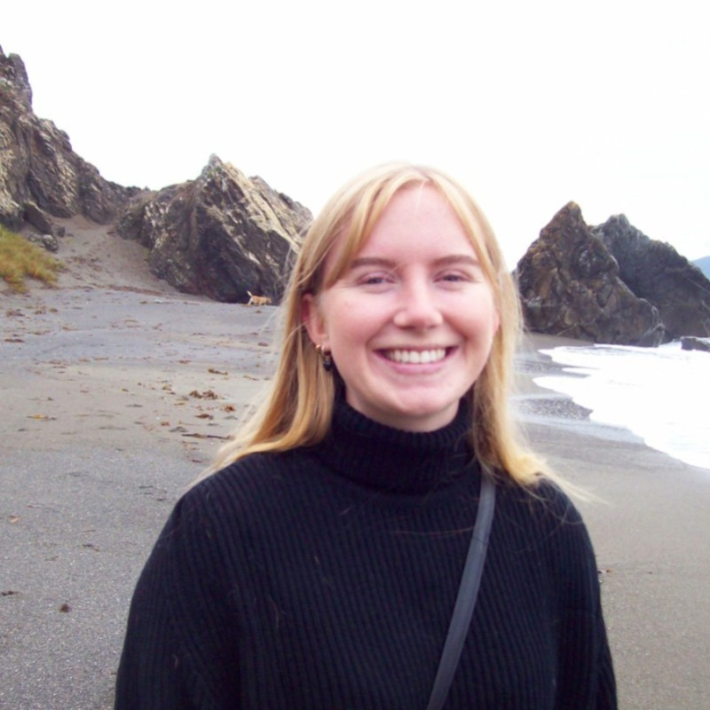
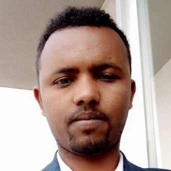
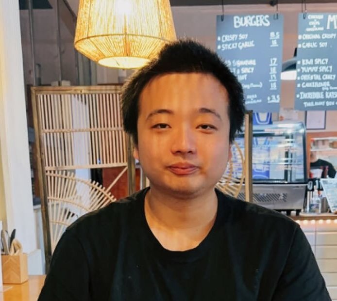
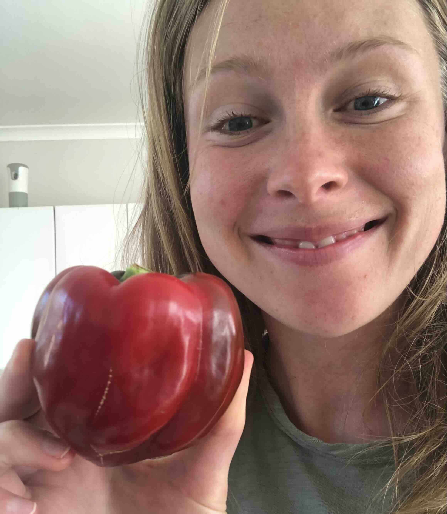
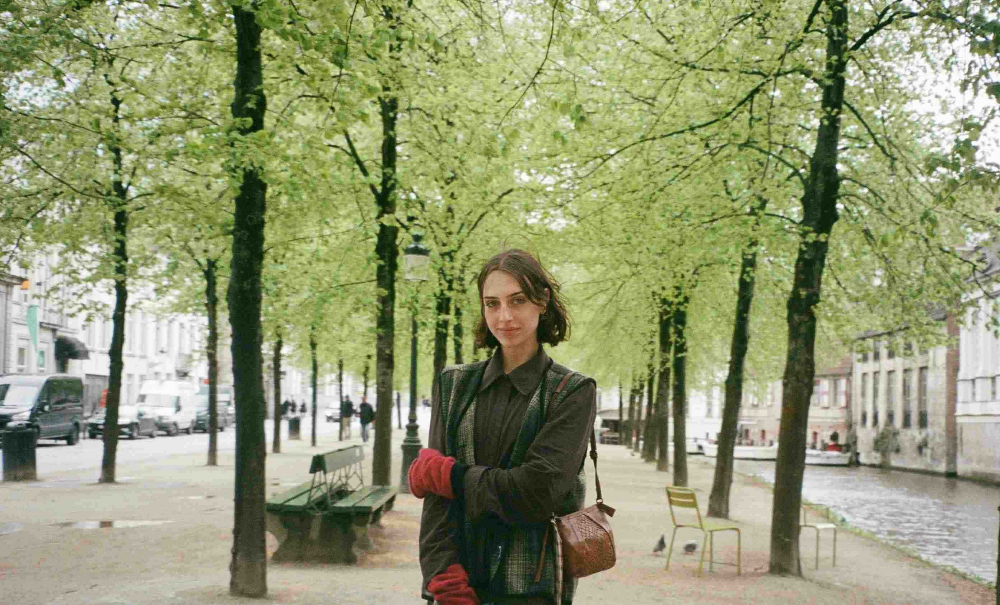

## Director

### Joseph Bulbulia

:::: {.columns}

::: {.column width="25%"}
{.team-photo}
:::

::: {.column width="65%"}
**Director, OTTO Lab**: 📧 joseph.bulbulia@vuw.ac.nz  
🔗 [University Profile](https://people.wgtn.ac.nz/joseph.bulbulia) [Full CV](https://www.dropbox.com/scl/fi/jtlekxwxf05rfu1dw5hw9/bulbulia-j-a-cv.pdf?rlkey=4mink1sq6hftvje39t4y53s46&dl=0)
::::

**About** 

OTTO Lab is based in the [School of Psychological Sciences](https://www.wgtn.ac.nz/psyc) at Te Herenga Waka - Victoria University of Wellington.

Joseph Bulbulia (Joe) teaches and researches in the [School of Psychological Sciences](https://www.wgtn.ac.nz/psyc) at Victoria University of Wellington. His research investigates the complex drivers of human cooperation, conflict, and well-being, with a focus on the role of religion and values. Joseph specialises in methodologies for inferring causality from observational data. He also directs the [Centre for Applied Cross-Cultural Research (CACR)](https://www.wgtn.ac.nz/cacr).

**Research Projects**
Joe contributes to two major longitudinal projects:

1. **New Zealand Attitudes and Values Study (NZAVS)**: Joe serves as a principal investigator on major NZAVS projects. He uses 15 years of repeated-measures longitudinal data from more than 76,000 New Zealanders to investigate religion, social cohesion, and trust.

2. **Pulotu Database of Pacific Religions**: As a founding co-investigator, Joe uses this database of 116 Austronesian cultures to test theories about the evolution of religious beliefs and their effects on social behaviour.

#### Supervision

Joe supervises students in a broad range of areas, including:

-   Personality and individual differences
-   Political psychology
-   Well-being/Flourishing
-   Religion (his primary interest)
:::

---

## PhD Students

### Jessie Auckram

:::: {.columns}

::: {.column width="25%"}
{.team-photo}
:::

::: {.column width="75%"}
Jessie is investigating individual differences in personal resilience related to deprivation. 

- **Project:** New Zealand Attitudes and Values Study (NZAVS)
- **Methods:** Heterogeneous Treatment Effects; Longitudinal Modified Treatment Policies; Causal Machine Learning
:::

::::

### Jake Ireland

:::: {.columns}

::: {.column width="25%"}
{.team-photo}
:::

::: {.column width="75%"}
Jake graduated with a Bachelor of Science in Psychology and Mathematics from Victoria University of Wellington in 2020.  During his studies, he contributed to research on cross-cultural psychology, drug abuse, and face perception.  Since graduating, he has worked in cyber security and, since 2022, has been researching cultural evolution with the Causal Lab at Victoria University.  He completed his Honours in 2024 and began his PhD in 2025. Jake is investigating the co-evolution of religious and political culture in the Pacific.

- **Project:** Pulotu
- **Methods:** Causal Machine Learning
- [ORCID Profile](https://orcid.org/0000-0003-3030-1341)
:::

::::

### Mohammad Islam

:::: {.columns}

::: {.column width="25%"}
{.team-photo}
:::

::: {.column width="75%"}
Mohammad is estimating the causal effects of Right-Wing Authoritarianism and Social Dominance Orientation on outcome-wide prejudice. He joins the lab from Bangladesh.

- **Project:** New Zealand Attitudes and Values Study (NZAVS)
- **Methods:** Heterogeneous Treatment Effects; Longitudinal Modified Treatment Policies; Causal Machine Learning
:::

::::

### Mekonnen Tsehay

:::: {.columns}

::: {.column width="25%"}
{.team-photo}
:::

::: {.column width="75%"}
Mekonnen is estimating the causal effects of religious ritual behaviours on health and wellbeing among religiously identified people in New Zealand. He joins the lab from Ethiopia.

- **Project:** New Zealand Attitudes and Values Study (NZAVS)
- **Methods:** Heterogeneous Treatment Effects; Longitudinal Modified Treatment Policies; Causal Machine Learning
:::

::::

---

## Master's Students

### Boyang Cao

:::: {.columns}

::: {.column width="25%"}
{.team-photo}
:::

::: {.column width="75%"}
Boyang is researching the causal effects of prejudice on personality.

- **Project:** New Zealand Attitudes and Values Study (NZAVS)
- **Methods:** Heterogeneous Treatment Effects; Longitudinal Modified Treatment Policies; Causal Machine Learning
:::
::::

### Hannah Robinson

:::: {.columns}

::: {.column width="25%"}
{.team-photo}
:::

::: {.column width="75%"}
Hannah is researching the causal effects of religious service attendance on personality.

- **Project:** New Zealand Attitudes and Values Study (NZAVS)
- **Methods:** Heterogeneous Treatment Effects; Longitudinal Modified Treatment Policies; Causal Machine Learning
:::

::::

### Zahle Wisely

:::: {.columns}

::: {.column width="25%"}
{.team-photo}
:::

::: {.column width="75%"}
Zahle is investigating the causal effects of employer gratitude on multi-dimensional well-being.

- **Project:** New Zealand Attitudes and Values Study (NZAVS)
- **Methods:** Heterogeneous Treatment Effects; Longitudinal Modified Treatment Policies; Causal Machine Learning
:::

::::

---

## Research Assistants

### Millie Rea

:::: {.columns}

::: {.column width="25%"}
{.team-photo}
:::

::: {.column width="75%"}
Millie is investigating extensions of OTTO Lab workflows to policy settings, focusing on IDI (Integrated Data Infrastructure) data.

- **Methods:** Heterogeneous Treatment Effects; Longitudinal Modified Treatment Policies; Causal Machine Learning
:::
::::

---

## Alumni

### Dr. Inkuk Kim

:::: {.columns}

::: {.column width="25%"}
{.team-photo}
:::

::: {.column width="75%"}
Dr. Inkuk Kim worked with OTTO Lab as a Research Fellow at the Centre for Applied Cross-cultural Research and the School of Psychological Sciences at Victoria University of Wellington. He has moved to take up a postdoctoral fellowship at the HAPPI Lab at Georgia State University (GSU), working with [Don E. Davis](https://news.gsu.edu/coronavirus-expert/don-davis-jr/). Inkuk remains a Fellow of OTTO Lab and is working on projects related to environmental psychology, trust in science, and character formation over the adult lifespan.

- **Project:** New Zealand Attitudes and Values Study (NZAVS)
- **Methods:** Longitudinal Modified Treatment Policies; Causal Machine Learning
- [ORCID Profile](https://orcid.org/0000-0002-7694-6295)
- [University Profile](https://people.wgtn.ac.nz/inkuk.kim)
- [GitHub](https://github.com/Inkuk-Kim)
:::

::::

### Dr. John Mark Kempthorne

:::: {.columns}

::: {.column width="25%"}
{.team-photo}
:::

::: {.column width="75%"}
John Mark received his PhD from the School of Psychology at Victoria University of Wellington in 2025. His disseration investigated application of causal methods to NZAVS time-series data. He is currently working as a Post-doctoral Fellow at the [Shaver Lab](https://anthropology.artsandsciences.baylor.edu/person/john-h-shaver)

- [ORCID Profile](https://orcid.org/0000-0001-6398-7509)
:::
::::

### Bella Chong

:::: {.columns}

::: {.column width="25%"}
{.team-photo}
:::

::: {.column width="75%"}
Bella received her Master's degree from Victoria University of Wellington in 2023. Her research investigated the causal effects of work hours on multi-dimensional well-being.

- **Project:** New Zealand Attitudes and Values Study (NZAVS)
- **Methods:** Longitudinal Modified Treatment Policies
- [ORCID Profile](https://orcid.org/0000-0002-0206-0782)
:::
::::

---

<!-- ## Collaborators -->

<!-- We work with researchers and institutions worldwide to advance causal inference methods and applications. -->

---

## Join the lab

If you're interested in joining the lab, please contact:

📧 **joseph.bulbulia@vuw.ac.nz**
